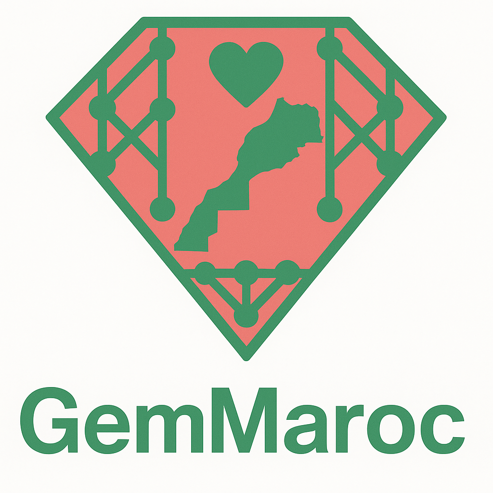

# 🌍💬 GemMaroc — State-of-the-Art Moroccan Darija LLM

<p align="center">
  
</p> <!-- Optional if you have a banner image -->

**GemMaroc** is an **open-source, instruction-tuned** Large Language Model for **Moroccan Arabic (Darija)**, built on **Gemma** and fine-tuned with an *efficient, low-carbon* methodology.

In just **2.5 months** since its release (**May 22, 2025**), **GemMaroc** has been downloaded **16,733+ times** — proving the demand for inclusive AI that empowers underrepresented languages.

---

## 🚀 Highlights

- **State-of-the-art** performance on Darija benchmarks:
  - **61.6%** on *DarijaMMLU* (matches the best published results)
  - **62.33%** on *DarijaHellaSwag* (**+12.1** points over Atlas-Chat)
- **Balanced bilingual reasoning** — retains strong English reasoning (84.2% GSM8K)
- **Ultra-efficient training**:
  - Just **≈50 GPU·hours on H100** (~**$200** on standard cloud)
  - ~**2%** of the energy footprint of comparable baselines
- **Completely open**:
  - Models, datasets, training scripts, and evaluation code — all available

---

## 📊 Evaluation Results

| Model / Benchmark               | Size (B) | DarijaMMLU | DarijaHellaSwag | Sentiment Analysis | GSM8K-darija-gen | Summarization chrF  | Summarization ROUGE-1 | Summarization ROUGE-L | Summarization BERTScore | MMLU  | TruthfulQA | HellaSwag | GSM8K @5 | GSM8K-gen |
|----------------------------------|----------|------------|-----------------|--------------------|------------------|-------|---------|---------|-----------|-------|------------|-----------|----------|-----------|
| Gemma3-4b-it                     | 4        | 32.8       | 36.3            | 58.94              | 52.77            | 27.22 | 8.38    | 8.19    | 37.23     | 51.1  | 40.88      | 47.65     | 74.75    | 89.08     |
| **GemMaroc-4b-Tulu (ours)**      | 4        | 47.53      | 47.13           | 53.29              | 37.91            | 28.46 | 8.89    | 8.76    | 39.27     | 54.14 | 43.33      | 73.95     | 55.95    | 71.57     |
| ALLaM-Instruct-7b                | 7        | 59.49      | 50.09           | 47.33              | 40.33            | 10.27 | 1.68    | 1.68    | 12.28     | 58.31 | 42.11      | 75.2      | 49.28    | 68.61     |
| Atlas-Chat-9B                    | 9        | 58.32      | 43.65           | 81.85              | 66.69            | 32.07 | 9.5     | 9.45    | 47.00     | 69.09 | **67.56**  | 73.35     | 73.01    | 77.03     |
| Atlas-Chat-27B                   | 27       | **61.95**  | 48.37           | **73.00**          | 71.04            | **32.75** | **10.53** | 10.42    | **47.82** | 72.06 | 43.82      | 77.84     | 82.03    | 82.34     |
| Gemma-3-27b-it                   | 27       | 55.65      | 49.13           | 60.27              | 82.71            | 28.33 | 10.28   | 9.95    | 38.17     | **78.12** | **63.05**  | **86.02** | **95.90** | **95.60** |
| **GemMaroc-27b-Tulu (ours)**     | 27       | **61.61**  | **62.33**       | 59.25              | **84.46**        | 28.34 | 9.00    | **11.20** | **39.50** | **73.60** | 55.45      | **82.06** | **84.23** | **93.18** |


---

## 🛠️ How to Use in LM Studio

To run the model locally in [LM Studio](https://lmstudio.ai):

1. Open LM Studio.
2. Go to **Models** → **Download Model**.
3. Search for:

```

AbderrahmanSkiredj1/GemMaroc-27b-it-GGUF

or

AbderrahmanSkiredj1/GemMaroc-4b-tulu-Q4_K_M-GGUF

or

AbderrahmanSkiredj1/GemMaroc-4b-v1.5-Q4_K_M-GGUF

````

4. Download the desired quantization variant.
5. Load the model and start chatting.

---

## 📚 Training Details

* **Base model**: Gemma 3-27B
* **Method**: LoRA fine-tuning on high-quality translated & reasoning-rich instructions (TULU)
* **Compute**: ≈50 GPU·h (H100), cost ≈ \$200
* **Green AI**: ~26 kWh energy use (~10 kg CO₂e)

---

## 📜 Citation

If you use GemMaroc in your research, please cite:

```bibtex
@misc{skiredj2025gemmarocunlockingdarijaproficiency,
      title={GemMaroc: Unlocking Darija Proficiency in LLMs with Minimal Data}, 
      author={Abderrahman Skiredj and Ferdaous Azhari and Houdaifa Atou and Nouamane Tazi and Ismail Berrada},
      year={2025},
      eprint={2505.17082},
      archivePrefix={arXiv},
      primaryClass={cs.CL},
      url={https://arxiv.org/abs/2505.17082}, 
}
````

---

### 💡 Final Note

GemMaroc proves that **quality over quantity** works — delivering **state-of-the-art Darija** with minimal resources, full transparency, and open access.
We hope it inspires more work for underrepresented languages worldwide.
